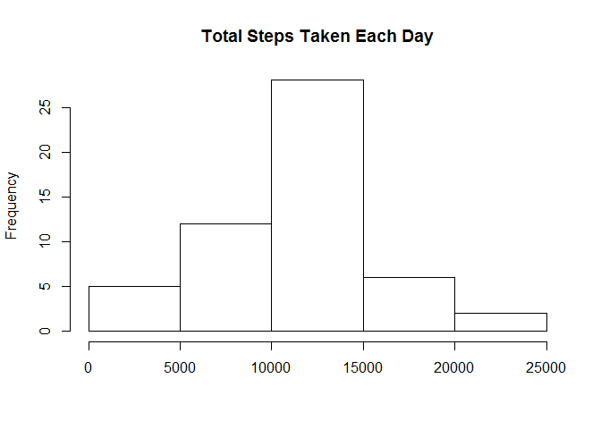
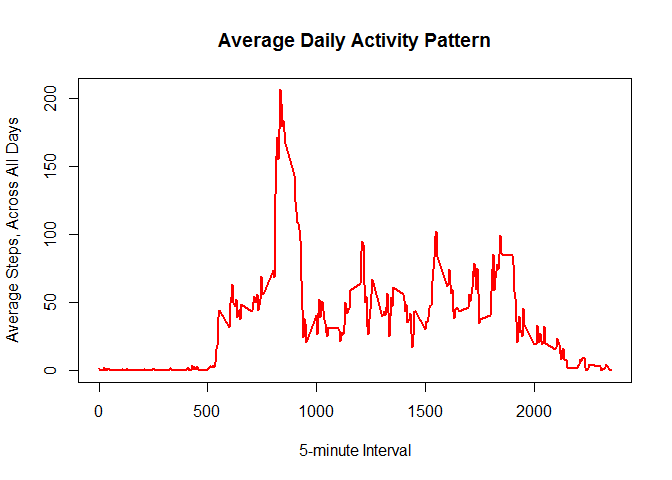
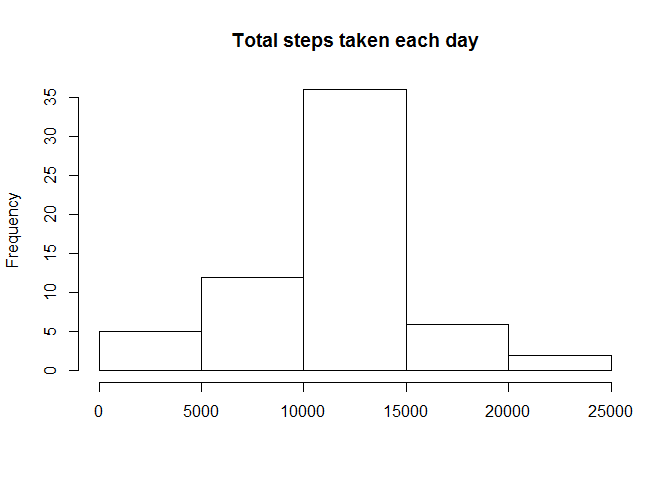

# Reproducible Research: Peer Assessment 1


## Loading and preprocessing the data

```r
activity1<- unzip("C:/Users/POONAM/Documents/RepData_PeerAssessment1/activity.zip")
activity <- read.csv(activity1, colClasses=c("numeric", "character", "numeric"))
activity$date <- as.Date(activity$date, "%Y-%m-%d")
```

## What is mean total number of steps taken per day?

```r
steps_per_day <- aggregate(steps ~ date, activity, sum)
hist(steps_per_day$steps, main="Total Steps Taken Each Day", xlab="")
```

 


#### To calculate the mean and median of the total steps per day

```r
mean_steps <-mean(steps_per_day$steps)
mean_steps
```

```
## [1] 10766.19
```

```r
median_steps <-median(steps_per_day$steps)
median_steps
```

```
## [1] 10765
```

## What is the average daily activity pattern?

*Make a time series plot (i.e. type = "l") of the 5-minute interval (x-axis) and the average number of steps taken, averaged across all days (y-axis)*

Now I get mean of steps and time series plot


```r
steps_interval <- aggregate(steps~interval, activity, mean)

plot(steps_interval$interval,steps_interval$steps, type="l", col="red", main="Average Daily Activity Pattern", xlab="5-minute Interval", ylab="Average Steps, Across All Days", lwd=2)
```

 

Which 5-minute interval, on average across all the days in the dataset, contains the maximum number of steps?


```r
max_interval <- steps_interval[which.max(steps_interval$steps),]
max_interval
```

```
##     interval    steps
## 104      835 206.1698
```


## Imputing missing values
    **1.Total number of missing values:**

```r
missing_vals <- sum(is.na(activity))
missing_vals
```

```
## [1] 2304
```
    **2. Filling in all of the missing values in the dataset with mean.**


```r
   imp_activity <- lapply(activity, function(x) { 
  x[is.na(x)] <- mean(x, na.rm = TRUE)
  x
})
```
     **3. To check whether their are any missing values**


```r
sum(is.na(imp_activity))
```

```
## [1] 0
```

**Total number of steps taken per day on Revised dataset**


```r
stepsperday1 <- aggregate(steps ~ date, imp_activity, sum)
```

**Make a histogram of the total number of steps taken each day using revised dataset**


```r
hist(stepsperday1$steps, ylab="Frequency", xlab = "", main="Total steps taken each day")
```

 

#### Calculate and report the mean and median total number of steps taken per day on revised 


```r
mean_steps1 <- mean(stepsperday1$steps)
median_steps1 <- median(stepsperday1$steps)
mean_steps1
```

```
## [1] 10766.19
```

```r
median_steps1
```

```
## [1] 10766.19
```
##Do these values differ from the estimates from the first part of the assignment?

**To compare the mean and median before and after revision of the dataset**

```r
comp_mean <- mean_steps == mean_steps1
comp_median <- median_steps == median_steps1
comp_mean
```

```
## [1] TRUE
```

```r
comp_median
```

```
## [1] FALSE
```
Yes, these values do differ slightly.We see that the values after filling the data mean and median are equal.

###What is the impact of imputing missing data on the estimates of the total daily number of steps?

As you can see, comparing with the calculations done in the first section of this document, we observe that while the mean value remains unchanged, the median value has shifted and virtual matches to the mean.Impact of imputing missing values has increase our peak in histogram, but did not affect negatively  to our predictions.

## Are there differences in activity patterns between weekdays and weekends?

**Creating a new factor variable in the dataset with two levels - "weekday" and "weekend" indicating whether a given date is a weekday or weekend day.**

```r
daytype <- function(date) {
  if (weekdays(as.Date(date)) %in% c("Saturday", "Sunday")) {
    "weekend"
  } else {
    "weekday"
  }
}
imp_activity$daytype <- as.factor(sapply(imp_activity$date, daytype))
```

**Make a panel plot containing a time series plot (i.e. type = "l") of the 5-minute interval (x-axis) and the average number of steps taken, averaged across all weekday days or weekend days (y-axis).**


```r
stepsByDay <- aggregate(steps ~ interval + daytype, data = imp_activity, mean)
library(lattice)
xyplot(steps ~ interval | daytype, stepsByDay, type = "l", layout = c(1, 2), xlab = "Interval", ylab = "Number of steps")
```

 


